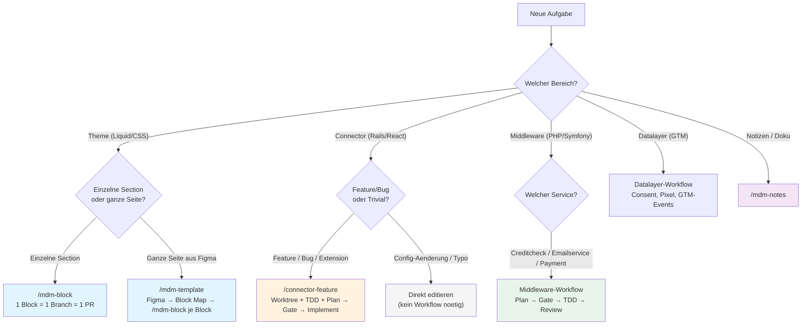
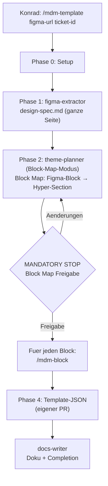
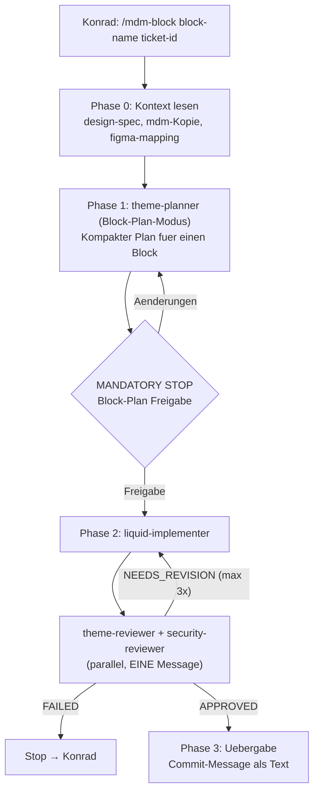
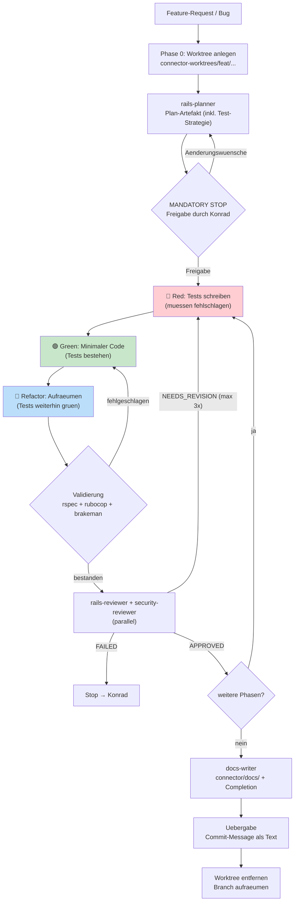
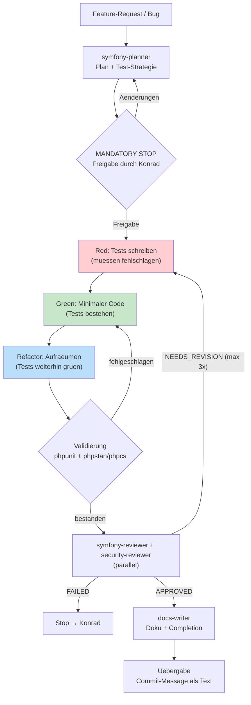

# MDM Workspace — Harness-Systemuebersicht

Stand: 1. September 2026. KI-Steuerungsschicht (Harness) fuer den MDM-Workspace.
Liegt in `.claude/` — keine KI-Spuren in versionierten Artefakten.

## Workspace-Layout

```
~/MDM/
├── themes/mdm/             Shopify Theme MDM (Hyper 1.3.3, eigenes Git-Repo, GitHub)
├── themes/borek/           Shopify Theme Borek (eigenes Git-Repo, GitHub)
├── themes/imm/             Shopify Theme IMM (eigenes Git-Repo, GitHub)
├── connector/              Rails 8.1 Backend (eigenes Git-Repo, GitHub)
├── connector-worktrees/    Git-Worktrees fuer parallele Feature-Branches
├── datalayer/              GTM-Datalayer (eigenes Git-Repo, GitHub)
├── creditcheck/            PHP/Symfony Creditcheck + CustomerInfo (GitLab)
├── emailservice/           PHP/Symfony E-Mail via Emarsys (GitLab)
├── payment-service/        PHP/Symfony + Nuxt Payment (GitLab)
├── Tickets/                Ticket-Artefakte (planuebergreifend)
├── .claude/                Harness (diese Struktur)
├── CLAUDE.md               Workspace-Regeln
└── .mcp.json               MCP-Server
```

## Entscheidungsbaum — Welcher Workflow?



## Workflow — Theme (Block-per-PR)

Grundprinzip: **Theme-First.** Bestehende Hyper-Sections ueberschreiben/erweitern,
nicht neu bauen. Jeder Block = ein Branch = ein PR.
Kein Unit-Test-Framework fuer Liquid — stattdessen `shopify theme check` + manueller Smoke-Test.

### Page-Level (/mdm-template): Figma-Seite → Block Map → Block-PRs



### Block-Level (/mdm-block): Einzelner Section-Override



## Workflow — Connector (TDD + Git Worktree)

Jedes Feature laeuft in einem eigenen **Git Worktree** unter `connector-worktrees/`.
Implementierung folgt **TDD: Red → Green → Refactor** in jeder Phase.



### Git-Worktree-Konvention

```
connector/                      Haupt-Worktree (bleibt auf main)
connector-worktrees/
├── feat/<ticket-id>-<name>/    Feature-Branch
├── fix/<ticket-id>-<name>/     Bugfix-Branch
└── ...
```

Befehle:
- Anlegen: `cd connector && git worktree add ../connector-worktrees/feat/<branch> -b feat/<branch>`
- Auflisten: `cd connector && git worktree list`
- Entfernen: `cd connector && git worktree remove ../connector-worktrees/feat/<branch>`

### TDD-Zyklus (Pflicht fuer jede Connector-Phase)

```
1. 🔴 Red    — Spec schreiben, die das Verhalten beschreibt
                → bundle exec rspec (MUSS fehlschlagen)
2. 🟢 Green  — Minimalen Code schreiben
                → bundle exec rspec (MUSS bestehen)
3. 🔵 Refactor — Code aufraeumen, keine neuen Features
                → bundle exec rspec (MUSS weiterhin bestehen)
```

Test-Stack: RSpec + FactoryBot + Shoulda-Matchers + WebMock + VCR.
Specs unter `connector/spec/` (models, jobs, requests, services).

## Workflow — Middleware (PHP/Symfony)

Drei Middleware-Services: creditcheck (PHP 7.4), emailservice (PHP 8.3/Symfony 7.1),
payment-service (PHP 8.3/Symfony 7.1 + Nuxt). Alle auf GitLab (gitlab.mdm.de),
Docker-basiert, CI via GitLab CI + Jenkins.



## Agents (`.claude/agents/`)

### Theme-Agenten

| Agent | Modell | Rolle | Modi | Schreibrechte |
|---|---|---|---|---|
| figma-extractor | sonnet | Figma MCP → design-spec.md | full-page, per-block | Tickets/ |
| theme-planner | opus | Design → Hyper-Architektur | Block Map, Block Plan | Plan-Dateien |
| liquid-implementer | inherit | Setzt freigegebene Block-Plaene um | — | themes/<marke>/ |
| theme-reviewer | sonnet | QA: Konventionen, a11y, Performance, Visual Parity | — | **read-only** |

### Connector-Agenten

| Agent | Modell | Rolle | TDD | Schreibrechte |
|---|---|---|---|---|
| rails-planner | opus | Feature → Rails-Architektur + Test-Strategie | plant Tests | Plan-Dateien |
| rails-implementer | inherit | TDD-Zyklen: Red → Green → Refactor | fuehrt Tests aus | connector/ + worktrees |
| rails-reviewer | sonnet | QA: RuboCop, Tests, Queries, GraphQL, Extensions | prueft Coverage | **read-only** |

### Middleware-Agenten

| Agent | Modell | Rolle | TDD | Schreibrechte |
|---|---|---|---|---|
| symfony-planner | opus | Feature → Symfony-Architektur + Test-Strategie | plant Tests | Plan-Dateien |
| symfony-implementer | inherit | TDD-Zyklen: Red → Green → Refactor | fuehrt Tests aus | creditcheck/, emailservice/, payment-service/ |
| symfony-reviewer | sonnet | QA: PHPUnit, PHPStan, PHPCS, Doctrine, Security | prueft Coverage | **read-only** |

### Uebergreifende Agenten

| Agent | Modell | Rolle | Schreibrechte |
|---|---|---|---|
| security-reviewer | sonnet | Security: XSS, DSGVO, Secrets, Auth (alle Repos) | **read-only** |
| docs-writer | haiku | Deutsche Doku + Completion-Artefakte | docs/, Tickets/ |

Alle mit `memory: project` — sie bauen Wissen ueber Patterns auf.

## Skills (`.claude/skills/`)

- **mdm-template** — Page-Level-Orchestrator: Figma-Seite → Block Map → delegiert an /mdm-block
- **mdm-block** — Per-Block-Workflow: ein Block = ein Branch = ein PR (Theme-First)
- **connector-feature** — End-to-End-Workflow: Worktree + TDD + Plan → Gate → Implement → Review
- **middleware-feature** — End-to-End-Workflow fuer creditcheck/emailservice/payment-service (TDD + Plan → Gate → Implement → Review)
- **figma-to-liquid** — Extraktions-Konventionen (Tool-Reihenfolge, Token-Mapping)
- **mdm-notes** — Apple-Notes-Pflege (fester Notiz-Satz, Safe-Append-Protokoll)
- **theme-port** — Aenderung von einem Marken-Theme in die anderen uebertragen
  (`bin/theme-sync.sh`: Modus-Wahl, Sicherungen, Exit-Codes, Nachkontrolle)
- **jira-comment** — Schreibkonventionen fuer Jira-Ticket-Kommentare (Aufbau, ADF-Mentions)
- **setup** — Interaktives Setup: Repos klonen, lokale Umgebung einrichten
- **repo-bauplan** — Architektur-Blattsatz fuer ein Repo: nummerierte Etappen als
  Artifact-Seiten, HTML-Quelle unter `docs/bauplan/`, jede Aussage mit `Datei:Zeile` belegt

## Rules (`.claude/rules/`)

| Rule | Pfad-Scope | Inhalt |
|---|---|---|
| liquid-conventions | themes/*/sections,snippets,blocks,layout | Liquid/Hyper-Konventionen |
| templates-json | themes/*/templates | JSON-Template-Regeln |
| merchant-config | themes/*/config,locales | Merchant-verwaltete Dateien |
| connector-conventions | connector + connector-worktrees/*: app,config,db,lib,spec | Rails/Shopify-App-Konventionen + TDD-Pflicht |
| middleware-conventions | creditcheck,emailservice,payment-service | PHP/Symfony-Konventionen (3 Services) + TDD-Pflicht |

## Hooks (`.claude/hooks/`)

| Hook | Event | Wirkung |
|---|---|---|
| git-safety.sh | PreToolUse (Bash) | Blockt: force-push, push main, reset --hard, clean -f, theme publish/delete, push --live, --theme-editor-sync |
| protect-merchant-files.sh | PreToolUse (Edit/Write) | settings_data.json hart geblockt; FoxEcom-Kern + Namenskonvention → Rueckfrage |
| post-edit-theme-check.sh | PostToolUse (Edit/Write) | Theme Check gefiltert auf editierte Datei; Theme-Verzeichnis aus dem Pfad hergeleitet (themes/<marke>/) |
| post-edit-rubocop.sh | PostToolUse (Edit/Write) | RuboCop gefiltert auf editierte Datei (nur connector/*.rb) |
| post-edit-phpstan.sh | PostToolUse (Edit/Write) | PHPStan/PHPCS gefiltert auf editierte Datei (nur middleware/*.php) |
| stop-notify.sh | Stop | macOS-Notification |
| post-implement-harness-sync.sh | Stop | Prueft ob neue Agenten/Skills/Hooks/Rules in der README dokumentiert sind |
| bauplan-guard.sh | PreToolUse (Bash/Edit/Write) | Blockt Loeschen von `docs/bauplan/**`, Schrumpfen der Manifeste, Entfernen von Repos aus `workspace.yaml` |
| bauplan-staleness.sh | PostToolUse (Edit/Write) | Ordnet die geaenderte Datei den Blattsatz-Etappen zu (Zuordnung in `bin/bauplan_lib.py`), schreibt ins Ledger |
| bauplan-report.sh | Stop | Verdichtet das Ledger zu `.claude/bauplan/<repo>.STALE.md` — Arbeitsliste fuer `--refresh` |
| bauplan-verify.sh | Stop | Prueft den Bauplan-Bestand gegen `git HEAD`, schreibt `BESTAND-WARNUNG.md` bei Abweichung |

## MCP-Server

- **shopify-dev-mcp** (`.mcp.json`): `learn_shopify_api`, `search_docs_chunks`, `validate_theme`
- **Figma** (Connector, user-scope): Design-Extraktion
- **Apple Notes** (Connector, user-scope): Notiz-Pflege (nur Haupt-Thread)

## Feste Regeln (Kurzreferenz)

1. **Theme-First:** Hyper-Sections ueberschreiben, nicht neu bauen. Ein Block = ein PR.
2. FoxEcom-Originale unangetastet — Anpassungen als `mdm-*`-Kopie
3. Kein Code vor Plan-Freigabe; Reviews immer parallel; max. 3 Revisions-Loops
4. **TDD-Pflicht (Connector):** Kein Feature-Code ohne fehlschlagenden Test. Red → Green → Refactor.
5. **Git Worktree (Connector):** Jedes Feature in eigenem Worktree. Main bleibt sauber.
6. Claude committet/pusht nie — Commit-Message als Plain-Text
7. Kein `--theme-editor-sync`, kein Live-Push, kein `theme publish`
8. Evidenz-Labels in allen Artefakten; Doku deutsch, Commits englisch (50/72)
9. Uebersetzungen: `en.default.json` + `de.json` immer paarig
10. Keine KI-Spuren in Theme-Code, Commits oder versionierter Doku
11. Connector: RuboCop clean, Brakeman clean, RSpec gruen, Secrets nur in .env
12. Middleware: PHPUnit gruen, PHPStan/PHPCS clean (wo vorhanden), Secrets nur in .env

---

## Umgesetzte Erweiterungen

Die folgenden Features wurden am 26. August 2026 eingefuehrt und sind vollstaendig in
Agenten, Skills, Hooks und Rules integriert:

### Spec-Driven Development

Specs sind die **primaere Spezifikationssprache** im Connector-Workflow:

1. **Plan-Phase:** rails-planner schreibt Spec-Skeletons mit `pending('Phase N: Implementation')`.
   Konrad reviewed Plan UND Specs gemeinsam — die Specs SIND die Spezifikation.
2. **Freigabe = Specs eingefroren.** `describe`/`it`-Beschreibungen sind nach Freigabe fix.
3. **Implementierung:** rails-implementer entfernt `pending`, schreibt Assertions (Red),
   dann minimalen Code (Green), dann Refactor. Zusaetzliche Specs als `# Zusatz: <Begruendung>`.
4. **Review:** rails-reviewer prueft Skeleton-Treue, Coverage, Factory-Qualitaet.

### Git Worktrees fuer parallele Feature-Arbeit

Jedes Connector-Feature laeuft in einem eigenen Worktree unter `connector-worktrees/`.
Main bleibt immer sauber. Permissions in settings.json fuer Worktree-Pfade konfiguriert.
Details: siehe Abschnitt „Git-Worktree-Konvention" oben.

### Harness-Auto-Sync

Hook `post-implement-harness-sync.sh` laeuft beim Stop-Event und prueft, ob neue
Agenten, Skills, Hooks oder Rules existieren, die nicht in dieser README dokumentiert sind.
Bei Diskrepanz: Warnung an Konrad.
